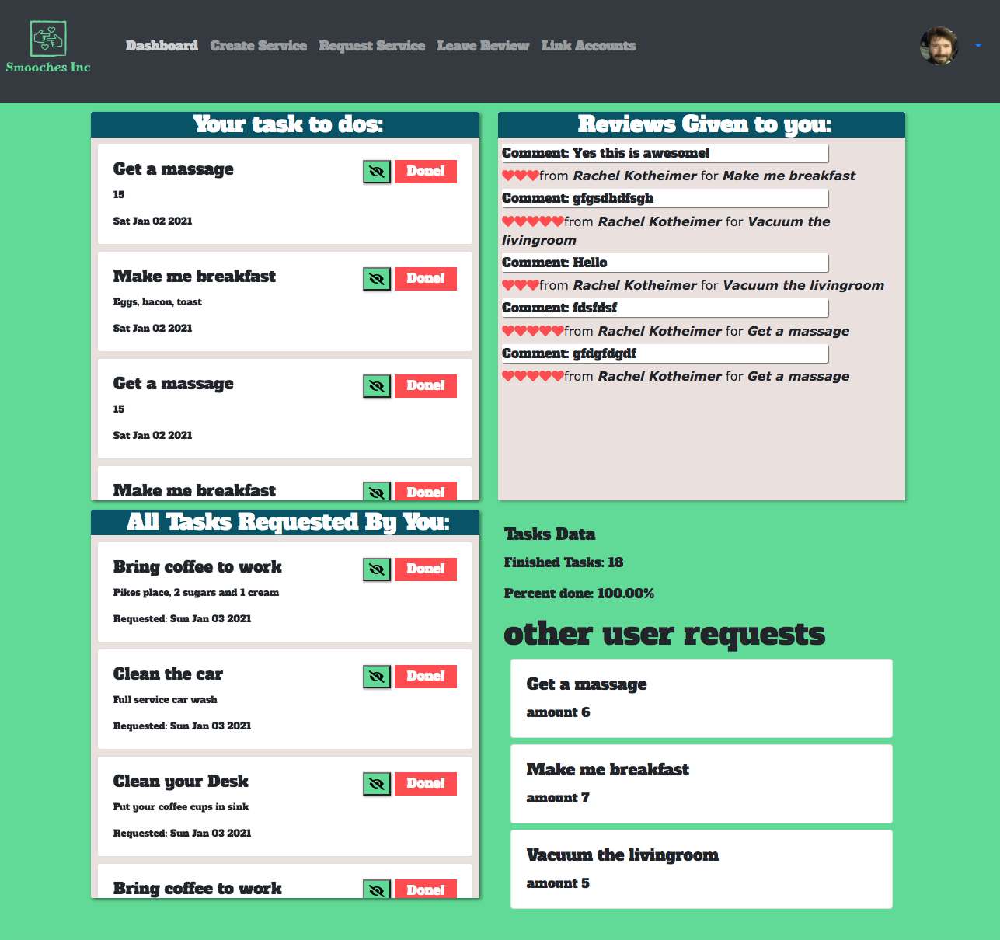
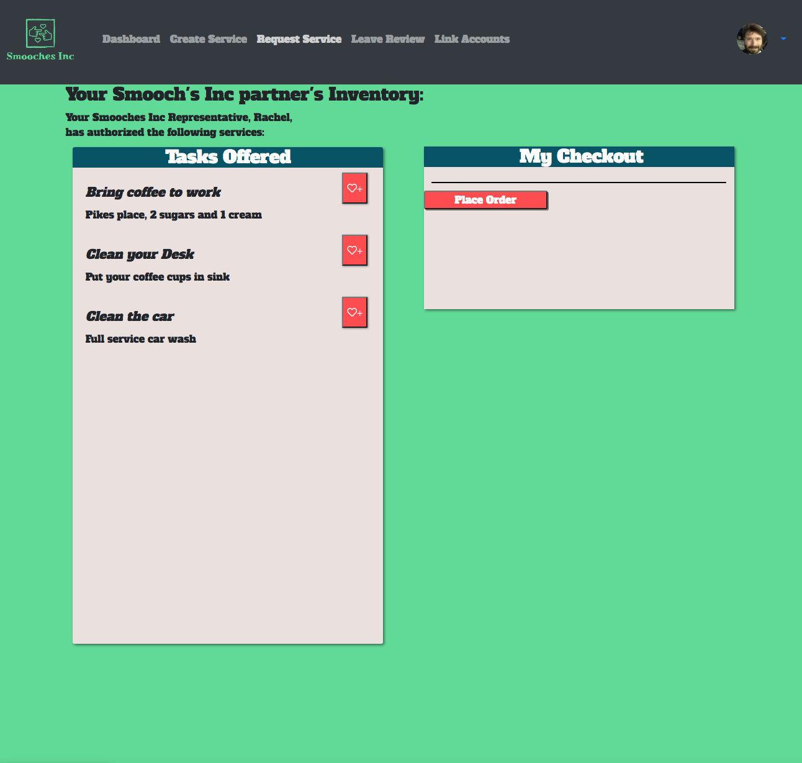

# Capstone: Smootches Inc

## Motivation

Relationships are hard. Asking for tasks done and chores done, even asking for what you want and need is sometimes hard. Smooches inc smoothes over the difficulty, by abstracting it to a kind of play ecommerce. A tagline for Smooches Inc borrows from the 5 love languages: "Acts of Service wrapped in Words of Affirmation".

## Build status

WIP

## Code Style

React, Firebase, Boostrap, Axios

## ERD

[https://lucid.app/lucidchart/invitations/accept/d3b707f8-0e1b-471e-adaf-1848d4d6e3b4](https://lucid.app/lucidchart/invitations/accept/d3b707f8-0e1b-471e-adaf-1848d4d6e3b4)

## Figma

[https://www.figma.com/file/0Ved1uCqezBMaz6ddTnpwH/SmootchesInc---NSS-FrontEnd-Capstone?node-id=0%3A1](https://www.figma.com/file/0Ved1uCqezBMaz6ddTnpwH/SmootchesInc---NSS-FrontEnd-Capstone?node-id=0%3A1)

## URL

[](https://app.netlify.com/sites/smootches-inc/deploys)

[https://smooches-inc.netlify.app](https://smooches-inc.netlify.app)

## Screencastify:

[https://drive.google.com/file/d/1CbKfxZsut9fFbeAeKrFFQa932che52pC/view](https://drive.google.com/file/d/1CbKfxZsut9fFbeAeKrFFQa932che52pC/view)

## Presentation:

[https://docs.google.com/presentation/d/1x9p36MlGjoAgPCz7RFPZSlolJRA6VZPxm3EhrTAzE4I/edit?usp=sharing](https://docs.google.com/presentation/d/1x9p36MlGjoAgPCz7RFPZSlolJRA6VZPxm3EhrTAzE4I/edit?usp=sharing)

## Screenshots:

Dashboard:



Checkout:



## Features

Smooches Inc allows users to request tasks from another person, who reciprocally can request tasks from them. It is set up like an ecommerce app but there are no payments. It should be seen a cooperative and useful way to communicate, rather than a quid pro quo.
The user will have the following features:

- Create User page
- Dashboard with components that show:
  - Outstanding tasks to do
  - Request Status (pending / shipped)
  - Reviews left
- Links to the following pages:
  - Create a Service (Page will have Crud for services to give)
  - Request a Service (Page will have ecommerce look with "Checkout" and confirmation screen, with "nice" messages in each part)
  - Create an task (or make a special offer by adding offer text and that will alert the other user next time they log in and show up in their "Things I can request" pile until used or expired (when another offer is created).
  - Leave a Review (Crud form that will allow reviews to be left).
    (not exhaustive)
    Stretch Goals:

Future stretch goals

- Limit user ability to select item.
- Send email or text
- Boilerplate messages sent for different circumstances (receiving user order "lost in mail", user not signed into app recently, user finishing orders on time consistently, high ratings, high usage,

## Code Example

```
import React from 'react';
import userData from '../../helpers/data/userData';

export default class LinkUserCard extends React.Component {
  state = {
    user: this.props.user,
    otherName: this.props.otherName,
    otherKey: this.props.otherKey,
    userKey: this.props.userKey,
    joinedUser: this.props.joinedUser
  }

  rejectUser = () => {
    userData.deleteUserConnect(this.state.joinedUser.firebaseKey);
    this.setState({
      joinedUser: null
    });
    console.warn('reject');
  }

  connectToUser = () => {
    userData.confirmUserJoin(this.state.joinedUser);
    const joined = this.state.joinedUser;
    joined.confirm = true;
    this.setState({
      joinedUser: joined
    });
    console.warn('connect');
  }

  render() {
    const { otherName, joinedUser, user } = this.state;
  return (<>
    <div className="card m-2">
      <div className="card-body">
      <h5 className="card-title">{otherName[Object.keys(otherName)].name}
      {joinedUser && (joinedUser.confirm) ? ' is connected' : ' is pending...'}.</h5>
      <div>{(joinedUser && (joinedUser.user2FBKey === user.uid) && (!joinedUser.confirm)) ? (
      <>
      <button onClick={this.connectToUser} className='btn btn-danger'>Connect</button>
      <button onClick={this.rejectUser} className='btn btn-danger'>Reject</button>
      </>
      ) : (joinedUser && (joinedUser.confirm) && 'congrats!')}</div>
      </div>
    </div>
    </>
  );
      }

}

```

## Team

Will Kotheimer
